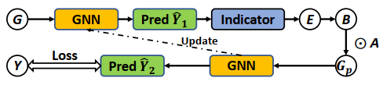
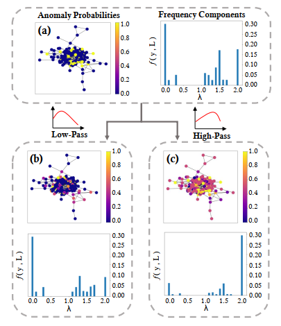
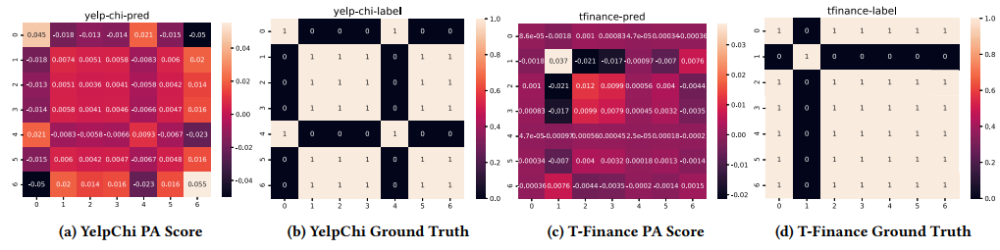

# GHRN: Addressing Heterophily in Graph Anomaly Detection: A Perspective of Graph Spectrum

This is a PyTorch implementation of 

Addressing Heterophily in Graph Anomaly Detection: A Perspective of Graph Spectrum (WWW2023)

# Overview
In this work, we aim to address the heterophily problem in the spectral domain. We point out that heterophily is positively associated with the frequency of a graph. Towards this end, we could prune inter-class edges by simply emphasizing and delineating the high-frequency components of the graph. We adopt graph Laplacian to measure the extent of 1-hop label changing of the center node and indicate high-frequency components. Our indicator can effectively reduce the heterophily degree of the graph and is less likely to be influenced by the prediction error.

<h2 align="center">
<figure> </figure>
</h2>

# Some questions
1. What is heterophily and how does it affect the performance of the GNNs?
Heterophily indicates the edges connecting nodes with different labels. Low-pass filters like GCN could undermine the discriminative
information of the anomalies on heterophilous graphs.

<h2 align="center">
<figure> </figure>
</h2>

2. How does indicator work?
GHRN will calculate the post-aggregation matrix for the graph, and a smaller value means a larger probability of the inter-class edges.

<h2 align="center">
<figure> </figure>
</h2>

# Dataset
YelpChi and Amazon can be downloaded from [here](https://github.com/YingtongDou/CARE-GNN/tree/master/data) or [dgl.data.FraudDataset](https://docs.dgl.ai/api/python/dgl.data.html#fraud-dataset). The T-Finance and T-Social datasets developed in the paper are on [google drive](https://drive.google.com/drive/folders/1PpNwvZx_YRSCDiHaBUmRIS3x1rZR7fMr?usp=sharing).

# Dependencies
```sh
- pytorch 1.9.0
- dgl 0.8.1
- sympy
- argparse
- sklearn
- scipy
- pickle
```

# Reproduce
```sh
python main.py --dataset tfinance
python main.py --dataset tfinance --del_ratio 0.015
```
Note that a delete ratio of 0 should be run first to get predictions y.

# Acknowledgement
Our code references:
- [BWGNN](https://github.com/squareRoot3/Rethinking-Anomaly-Detection)

# Reference 
```
@inproceedings{
    gao2023ghrn,
    title={Addressing Heterophily in Graph Anomaly Detection: A Perspective of Graph Spectrum},
    author={Yuan Gao, Xiang Wang, Xiangnan He, Zhenguang Liu, Huamin Feng, Yongdong Zhang},
    booktitle={WWW},
    year={2023},
}
```
